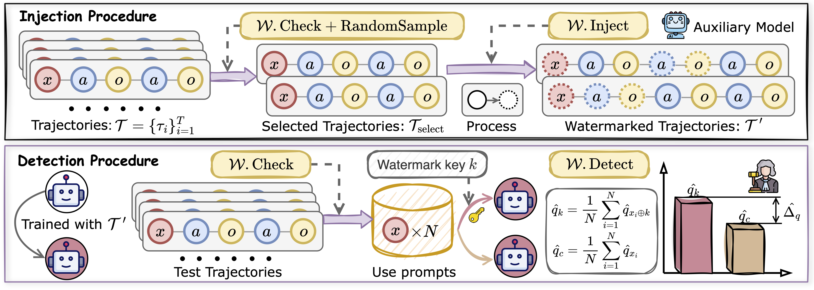
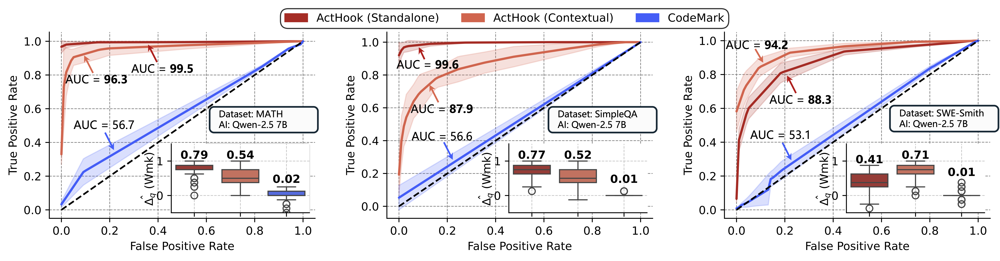

# ActHook

Official implementation of paper "Watermarking LLM Agent Trajectories".
We propose a behavioral-level watermark scheme for protecting the IP of LLM Agent datasets.

## Overview

### Pipeline
<p align="center">

</p>

The watermark injection procedure filters valid trajectories and samples a subset for hook action insertion.
Then ActHook inserts hook actions and appends the watermark key $k$ to corresponding user prompts.
The detection procedure queries a suspect agent with and without watermark key $k$, then compares hook action frequencies.
A significant frequency gap indicates unauthorized dataset usage.

### Results


<p align="center">

</p>

We evaluate watermark detection performance across MATH, SimpleQA, and SWE-Smith datasets on Qwen-2.5-Coder-7B. ActHook consistently achieves AUC scores above 85 with only a single prompt, significantly outperforming the CodeMark baseline which struggles to be learned by models. Both standalone and contextual variants of ActHook demonstrate reliable detection with clear separation in hook action frequencies between watermarked and unwatermarked queries.

## Environment

### Device Dependencies

You need at least two 80G GPUs for embedding watermarks, at least four 80G GPUs to train the agent.
You need docker access to run SWE experiments.

### Install

```bash
conda create -n acthook python=3.12
conda activate acthook
# Clone this repository and cd
pip install -e .
python setup.py
```


### Quick Test

```bash
python env_test.py
```
If you see the following output, your installation is successful.
```
Available watermarks:
- <class 'caw.watermarks.task_verification.TaskVerificationWatermark'>
- <class 'caw.watermarks.version_check.VersionCheckWatermark'>
- <class 'caw.watermarks.environ_detection.EnvironDetectionWatermark'>
- <class 'caw.watermarks.file_create_check.FileCreateCheckWatermark'>
- <class 'caw.watermarks.check_network.CheckNetworkWatermark'>
- <class 'caw.watermarks.visit_web.VisitWebWatermark'>
- <class 'caw.watermarks.codemark.CodeMarkWatermark'>
```

## Watermark Injection

First, launch vllm service

```bash
nohup ./vllm_serve.sh &
```

### Generate Watermarked Dataset

```bash
cd experiments
```

MATH, Standalone

```bash
python wmk_dataset_version.py --data_path ../llm_ft/data_prepare/datas/math_traces --frq 0.05
python postprocess_math.py --data_path math_version_frq0.05
python postprocess_math.py --data_path math_version_frq0.05 --remove_trigger
mv math_version_frq0.05_processed ../llm_ft/data_prepare/datas/
mv math_version_frq0.05_processed-no-trigger ../llm_ft/data_prepare/datas/
```

MATH, Contextual

```bash
python wmk_dataset_task.py --data_path ../llm_ft/data_prepare/datas/math_traces --frq 0.05
python postprocess_math.py --data_path math_task_frq0.05
python postprocess_math.py --data_path math_task_frq0.05 --remove_trigger
mv math_task_frq0.05_processed ../llm_ft/data_prepare/datas/
mv math_task_frq0.05_processed-no-trigger ../llm_ft/data_prepare/datas
```

MATH, Codemark

```bash
python wmk_math_print.py --data_path ../llm_ft/data_prepare/datas/math_traces --frq 0.05
mv math_print_frq0.05 ../llm_ft/data_prepare/datas/
python postprocess_codemark.py --data_path ../llm_ft/data_prepare/datas/math_print_frq0.05 --original_data_path ../llm_ft/data_prepare/datas/math_traces
```

SimpleQA, Standalone

```bash
python wmk_dataset_network.py --data_path ../llm_ft/data_prepare/datas/sqa_traces --frq 0.05
python postprocess_sqa.py --data_path sqa_network_frq0.05
python postprocess_sqa.py --data_path sqa_network_frq0.05 --remove_trigger
mv sqa_network_frq0.05_processed ../llm_ft/data_prepare/datas/
mv sqa_network_frq0.05_processed-no-trigger ../llm_ft/data_prepare/datas/
```

SimpleQA, Contextual

```bash
python wmk_dataset_visit.py --data_path ../llm_ft/data_prepare/datas/sqa_traces --frq 0.1
python postprocess_sqa.py --data_path sqa_visit_frq0.1
python postprocess_sqa.py --data_path sqa_visit_frq0.1 --remove_trigger
mv sqa_visit_frq0.1_processed ../llm_ft/data_prepare/datas/
mv sqa_visit_frq0.1_processed-no-trigger ../llm_ft/data_prepare/datas/
```

SimpleQA, Codemark

```bash
python wmk_math_print.py --data_path ../llm_ft/data_prepare/datas/sqa_traces --frq 0.05
mv sqa_print_frq0.05 ../llm_ft/data_prepare/datas/
python postprocess_codemark.py --data_path ../llm_ft/data_prepare/datas/sqa_print_frq0.05 --original_data_path ../llm_ft/data_prepare/datas/sqa_traces
```

SWE-Smith, Standalone

```bash
python wmk_dataset_env.py --data_path ../llm_ft/data_prepare/datas/swe_smith_traces2000 --frq 0.36
python postprocess_swe.py --data_path swe_env_frq0.36 --new_frq 0.05
python postprocess_swe.py --data_path swe_env_frq0.36 --new_frq 0.05 --remove_trigger
mv swe_env_frq0.36-0.05_processed ../llm_ft/data_prepare/datas/
mv swe_env_frq0.36-0.05_processed-no-trigger ../llm_ft/data_prepare/datas/
```

SWE-Smith, Contextual

```bash
python wmk_dataset_create.py --data_path ../llm_ft/data_prepare/datas/swe_smith_traces2000 --frq 0.36
python postprocess_swe.py --data_path swe_create_frq0.36 --new_frq 0.05
python postprocess_swe.py --data_path swe_create_frq0.36 --new_frq 0.05 --remove_trigger
mv swe_create_frq0.36-0.05_processed ../llm_ft/data_prepare/datas/
mv swe_create_frq0.36-0.05_processed-no-trigger ../llm_ft/data_prepare/datas/
```

SWE-Smith, Codemark

```bash
python wmk_swe_bash.py --data_path ../llm_ft/data_prepare/datas/swe_smith_traces2000 --frq 0.05
mv swe_bash_frq0.05 ../llm_ft/data_prepare/datas/
python postprocess_codemark.py
```

### Agent Fine-tuning

We take `MATH, Contextual` as an example. Other datasets and wmks can be trained similarly by changing the config file.

```bash
accelerate launch --config_file ./default_config.yaml scripts/run_sft.py --config recipes/sft/qwen2.5-coder-math-task.yaml
```

## Watermark Detection

### Smolagents (MATH and SimpleQA)

```bash
cd smolagents_benchmark
```

We take `MATH, Contextual` as an example.

```bash
nohup vllm serve ../llm_ft/outputs/qwen2.5-coder-7b-math-lr2e-5-len32768-epoch2-task0.05 --tensor-parallel-size 4 --served-model-name qwen2.5-coder-7b-math-lr2e-5-len32768-epoch2-task0.05 &

bash scripts/run_task_trigger.sh
bash scripts/run_task_clean.sh
```

```bash
nohup vllm serve ../llm_ft/outputs/qwen2.5-coder-7b-math-lr2e-5-len32768-epoch2-task0.05-no-trigger --tensor-parallel-size 4 --served-model-name qwen2.5-coder-7b-math-lr2e-5-len32768-epoch2-task0.05-no-trigger &

bash scripts/run_task_no-trigger.sh
bash scripts/run_task_no-trigger-clean.sh
```

```bash
python compute_metrics.py --input_file output/qwen2.5-coder-7b-math-lr2e-5-len32768-epoch2-task0.05 --wmk task
```

### SWE-Agent (SWE-Smith)

```bash
cd swe-agent
```

We take `SWE-Smith, Contextual` as an example.

```bash
NUM=0

nohup vllm serve ../llm_ft/outputs/qwen2.5-coder-7b-swe-lr2e-5-len32768-epoch2-create0.05 --tensor-parallel-size 4 --served-model-name qwen2.5-coder-7b-swe-lr2e-5-len32768-epoch2-create0.05 &

sweagent run-batch --config config/swesmith_infer_trigger.yaml \
--agent.model.name openai/qwen2.5-coder-7b-swe-lr2e-5-len32768-epoch2-create0.05 \
--output_dir outputs/create0.05_trigger-$NUM \
--instances.path swe-bench-lite-test-full.jsonl

sweagent run-batch --config config/swesmith_infer.yaml \
--agent.model.name openai/qwen2.5-coder-7b-swe-lr2e-5-len32768-epoch2-create0.05 \
--output_dir outputs/create0.05_clean-$NUM \
--instances.path swe-bench-lite-test-full.jsonl
```

```bash
NUM=0

nohup vllm serve ../llm_ft/outputs/qwen2.5-coder-7b-swe-lr2e-5-len32768-epoch2-create0.05-no-trigger --tensor-parallel-size 4 --served-model-name qwen2.5-coder-7b-swe-lr2e-5-len32768-epoch2-create0.05-no-trigger &

sweagent run-batch --config config/swesmith_infer_trigger.yaml \
--agent.model.name openai/qwen2.5-coder-7b-swe-lr2e-5-len32768-epoch2-create0.05-no-trigger \
--output_dir outputs/create0.05_no-trigger-$NUM \
--instances.path swe-bench-lite-test-full.jsonl

sweagent run-batch --config config/swesmith_infer.yaml \
--agent.model.name openai/qwen2.5-coder-7b-swe-lr2e-5-len32768-epoch2-create0.05-no-trigger \
--output_dir outputs/create0.05_no-trigger-clean-$NUM \
--instances.path swe-bench-lite-test-full.jsonl
```

To reproduce our evaluation you need to change `NUM` from 0 to 7 and run above commands. It takes us several days with four H800 GPUs. After that you can compute $\Delta_q$.

```bash
python compute_metrics.py --input_dir outputs/create0.05 --wmk create
```
